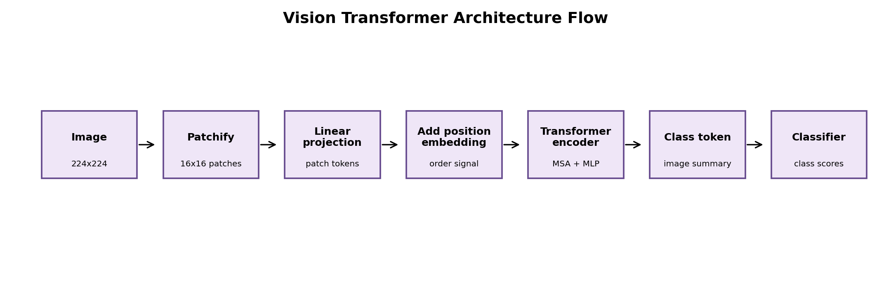

# Report: Vision Transformer Paper Review

## Motivation

We reviewed Vision Transformer as a research line because the original ViT paper does not fully explain how vision transformers became practical. Later work improved data efficiency, architecture, and pretraining.

## Papers Reviewed

We reviewed Dosovitskiy et al. 2020 on ViT, Touvron et al. 2020 on DeiT, Liu et al. 2021 on Swin Transformer, and He et al. 2021 on Masked Autoencoders.

## What The Papers Did

ViT showed that images can be split into patches and processed as token sequences by a Transformer. DeiT showed that careful training and distillation can reduce ViT's need for huge datasets. Swin Transformer added shifted local windows and hierarchy, making transformers better vision backbones. MAE used masked patch reconstruction for self-supervised pretraining.

## Method

We extracted each paper's contribution, limitation, and lesson. We also built a ViT architecture flow diagram and a patch-attention sketch.

## Review Artifacts

The repository contains reviewed-paper tables, a comparison table, ViT architecture/design diagrams in `review_artifacts/`, and one short note for each reviewed paper in `paper_notes/`.

## Interpretation

The main idea of ViT is simple: patches become tokens. The hard part is making this work efficiently and with enough data. DeiT, Swin, and MAE each solve a different weakness of the original ViT.

## Conclusion

ViT is best understood as the start of a family of models. Modern vision transformers combine patch tokenization, attention, better training recipes, hierarchy, and self-supervised pretraining.
